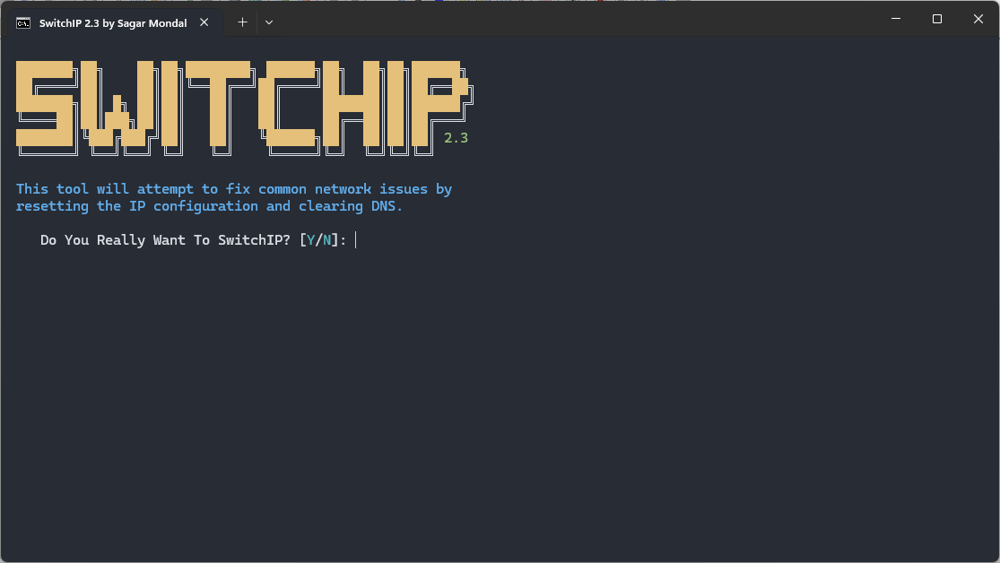
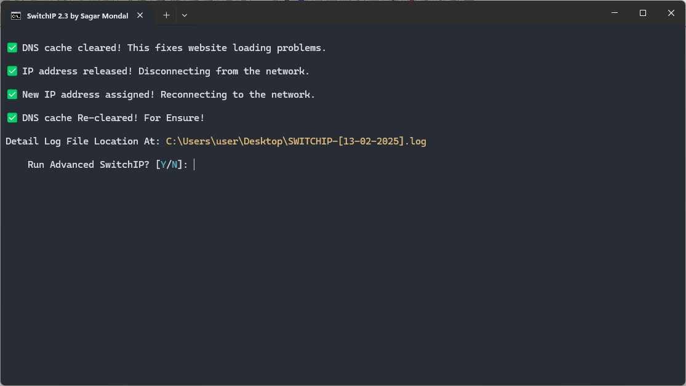
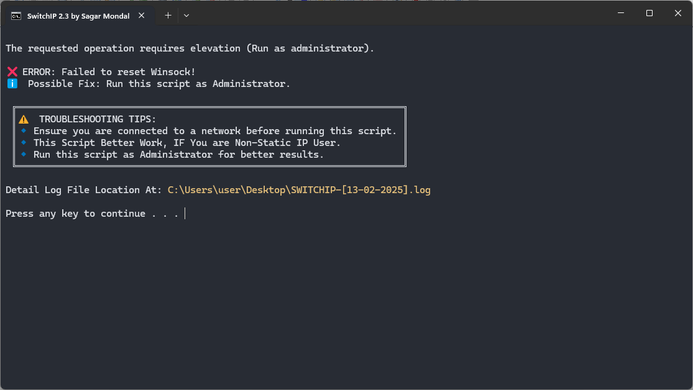

# SwitchIP - Network Troubleshooter
SwitchIP is a simple yet powerful batch script that helps diagnose and fix common internet issues. It automates network troubleshooting by clearing DNS cache, resetting IP configurations, and restarting the network adapter.

## 🛠 Features

- Flushes DNS cache to resolve website loading issues

- Releases and renews IP addresses to fix connectivity problems

- Resets Winsock and TCP/IP stack to repair corrupted network settings

- Restarts the network adapter to apply changes

- Provides real-time progress updates and error handling

## 📥 Installation

Download the SwitchIP.bat file from this repository.

Right-click the file and select Run as Administrator.

## 🔧 Usage

Ensure you have an active internet connection.

Run the script as Administrator to avoid permission errors.

Follow the on-screen instructions and wait for the process to complete.

If errors occur, check the troubleshooting section below.

## 💡 Additional Tips

If the problem persists, restart your PC and router.

Run the script periodically to keep your network settings fresh.

Contact your Internet Service Provider (ISP) if issues continue.

## 🤝 Contributing

Pull requests are welcome! If you find bugs or have suggestions, open an issue.

🔹 Created by [Sagar Mondal]

Happy Troubleshooting! 🛠️
